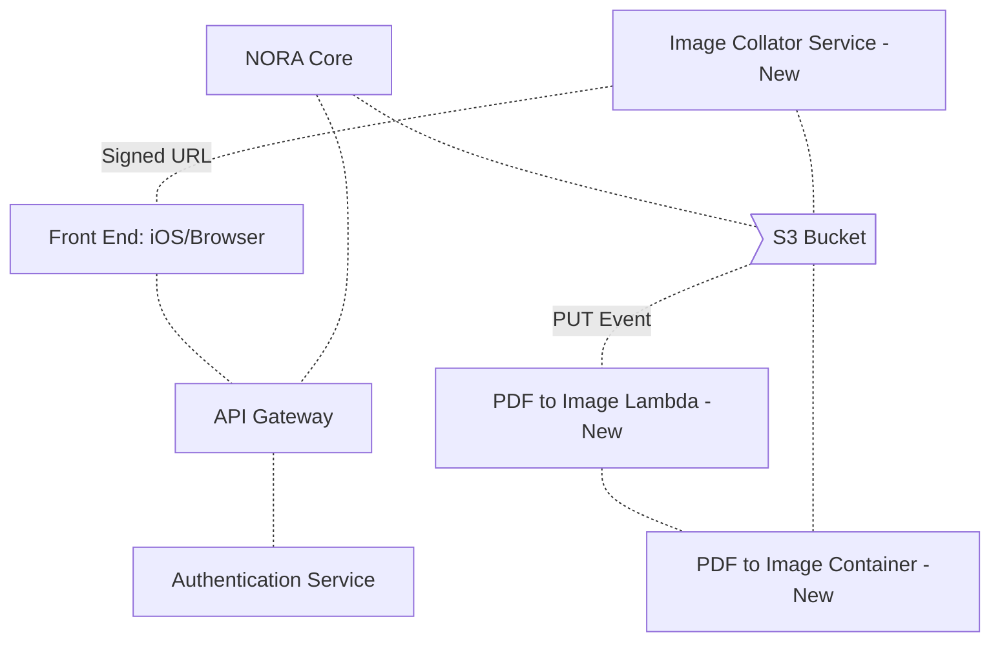
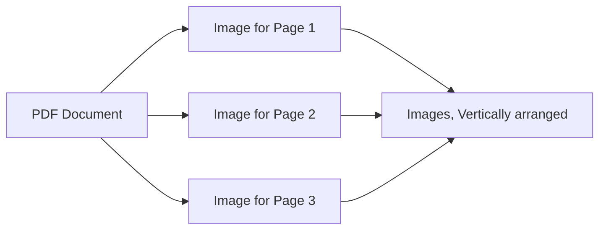
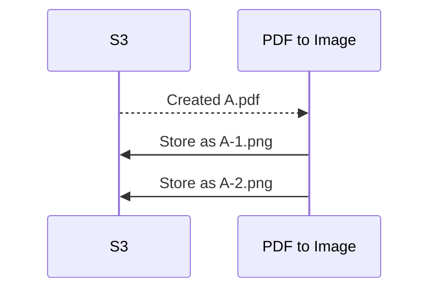

# Technical Design Template

<!-- vscode-markdown-toc -->
* [Meta](#Meta)
* [Markdown Authoring Tools and Viewers](#MarkdownAuthoringToolsandViewers)
	* [Diagrams](#Diagrams)
* [Glossary](#Glossary)
* [Purpose](#Purpose)
* [Tickets](#Tickets)
* [Assumptions](#Assumptions)
* [Technical Risks](#TechnicalRisks)
* [Potential Bugs](#PotentialBugs)
* [Systems](#Systems)
* [Processes](#Processes)
	* [Image Creation](#ImageCreation)
	* [S3 Lambda Event Processing](#S3LambdaEventProcessing)
* [API](#API)

<!-- vscode-markdown-toc-config
	numbering=false
	autoSave=true
	/vscode-markdown-toc-config -->
<!-- /vscode-markdown-toc -->

## <a name='Meta'></a>Meta

- Status: 
- Authors: Terris Linenbach
- Last updated:
- Created:
- [Slack](https://science37team.slack.com/messages/CLJS9SHCH)
- [Pull Request](https://github.com/Science37/lambda-pdf-to-img/pull/1) 

## <a name='MarkdownAuthoringToolsandViewers'></a>Markdown Authoring Tools and Viewers

- [Table of Contents Generator for VSCode](https://marketplace.visualstudio.com/items?itemName=joffreykern.markdown-toc)
- [HackMD.io: A Collaborative Markdown Editor](https://hackmd.io)
  - Log in using your Google account
  - **Do not use a trial account**
  - **Do not upload images**
  - **Share documents to only logged in users**
  - **When a document is complete, commit it to GitHub and remove it from HackMD.io**

### <a name='Diagrams'></a>Diagrams

- Example of an image diagram (can be stored in repo):


- [Create Text Diagrams](http://asciiflow.com/)
- This document contains [Mermaid](https://mermaidjs.github.io/) diagrams
   - [Chrome-GitHub Mermaid Viewer](https://chrome.google.com/webstore/detail/github-%2B-mermaid/goiiopgdnkogdbjmncgedmgpoajilohe?hl=en-US)
   - [Mermaid-Markdown Preview for VSCode](https://marketplace.visualstudio.com/items?itemName=bierner.markdown-mermaid) - Type ⌘-k, then v
   - [Mermaid Preview for VSCode](https://marketplace.visualstudio.com/items?itemName=vstirbu.vscode-mermaid-preview) - Put the cursor in a ```mermaid``` block, type Shift-⌘-P, then type "Preview Mermaid"

## <a name='Glossary'></a>Glossary

| Term    | Description            |
|---------|------------------------|
| AWS KMS | Key Management Service: AWS service for encryption and decryption
| [OAUTH2](https://tools.ietf.org/html/rfc6749) | "The OAuth 2.0 authorization framework enables a third-party application to obtain limited access to an HTTP service, either on behalf of a resource owner by orchestrating an approval interaction between the resource owner and the HTTP service, or by allowing the third-party application to obtain access on its own behalf" |

## <a name='Purpose'></a>Purpose

This document describes the technical implementation of the ? Service. 

## <a name='Tickets'></a>Tickets

| Ticket | Description |
| ------ | ----------- |
| [UNO-382](https://science37.atlassian.net/browse/UNO-382) | Take the OAuth2 authorization code and exchange it for a access_token/refresh_token |
| [UNO-383](https://science37.atlassian.net/browse/UNO-383) | endpoint for refreshing the access_token when it expires using the refresh token |

## <a name='Assumptions'></a>Assumptions

1. 

## <a name='TechnicalRisks'></a>Technical Risks

[See here for ideas](https://science37.atlassian.net/wiki/spaces/TECH/pages/509804643/Technology+Risk+Matrix)

1.

## <a name='PotentialBugs'></a>Potential Bugs

List any scenarios that testers should especially focus on.

1. 

## <a name='Systems'></a>Systems

The following diagram contains all relevant components including Unity and AWS services.



## <a name='Processes'></a>Processes

### <a name='ImageCreation'></a>Image Creation



### <a name='S3LambdaEventProcessing'></a>S3 Lambda Event Processing



## <a name='API'></a>API

See [API Documentation](api.md).
