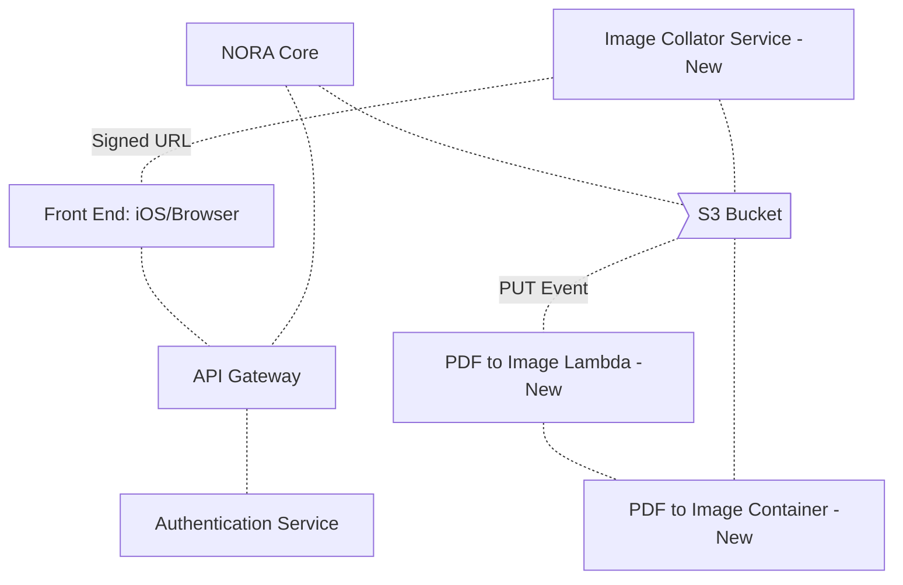
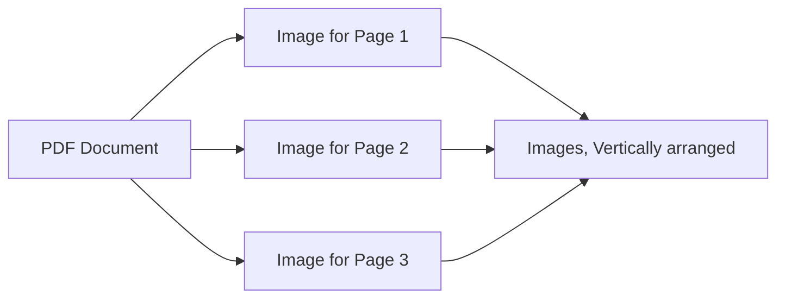
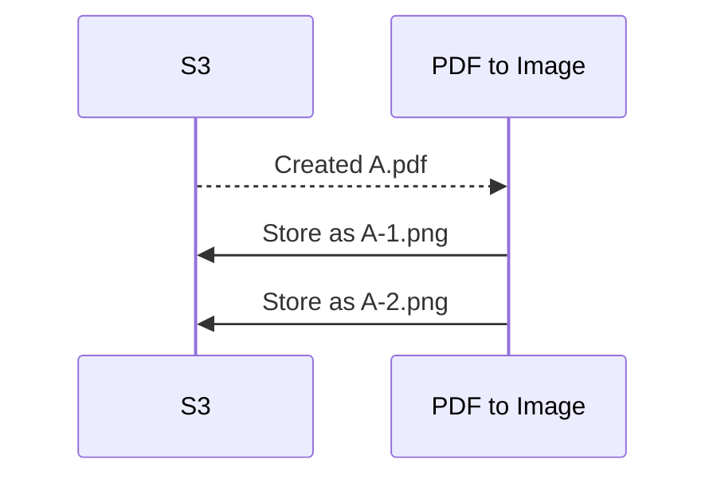

# Technical Design Template

## Meta

- Status: 
- Authors: Terris Linenbach
- Last updated:
- Created:
- [Slack](https://science37team.slack.com/messages/CLJS9SHCH)
- [Pull Request](https://github.com/Science37/lambda-pdf-to-img/pull/1) 

### Markdown Authoring Tools and Viewers

- [HackMD.io: A Collaborative Markdown Editor](https://hackmd.io)
  - Log in using your Google account
  - **Do not use a trial account**
  - **Do not upload images**
  - Commit markdown files to git repository
  - Delete documents on hackmd.io after you've finished editing
- [Dillinger: An Online Markdown Editor - and more!](https://dillinger.io/)
- [Create Attractive Markdown Tables](https://www.tablesgenerator.com/markdown_tables)
- [Create Text Diagrams](http://asciiflow.com/)

### Diagrams

- This document contains [Mermaid](https://mermaidjs.github.io/) diagrams
- Install the [Chrome Mermaid Extension](https://chrome.google.com/webstore/detail/github-%2B-mermaid/goiiopgdnkogdbjmncgedmgpoajilohe?hl=en-US) to view diagrams in files on github
- Install the [VSCode extension](https://marketplace.visualstudio.com/items?itemName=bierner.markdown-mermaid)

## Glossary

| Term    | Description            |
|---------|------------------------|
| AWS KMS | Key Management Service: AWS service for encryption and decryption
| [OAUTH2](https://tools.ietf.org/html/rfc6749) | "The OAuth 2.0 authorization framework enables a third-party application to obtain limited access to an HTTP service, either on behalf of a resource owner by orchestrating an approval interaction between the resource owner and the HTTP service, or by allowing the third-party application to obtain access on its own behalf" |

## Purpose

This document describes the technical implementation of the ? Service. 

## Tickets

| Ticket | Description |
| ------ | ----------- |
| [UNO-382](https://science37.atlassian.net/browse/UNO-382) | Take the OAuth2 authorization code and exchange it for a access_token/refresh_token |
| [UNO-383](https://science37.atlassian.net/browse/UNO-383) | endpoint for refreshing the access_token when it expires using the refresh token |

## Assumptions

1. 

## Risks and Potential Bugs

1. 

## Systems

The following diagram contains all relevant components including Unity and AWS services.

## Processes

### Image Creation

### S3 Lambda Event Processing

## API

See api.md
